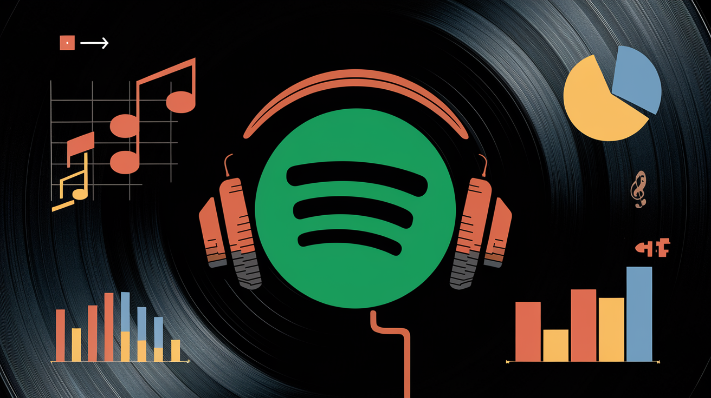
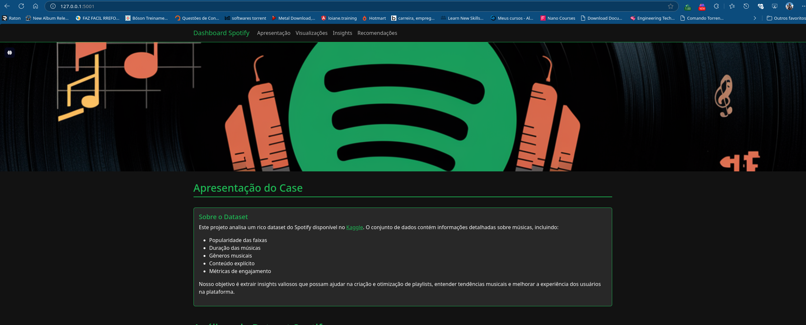
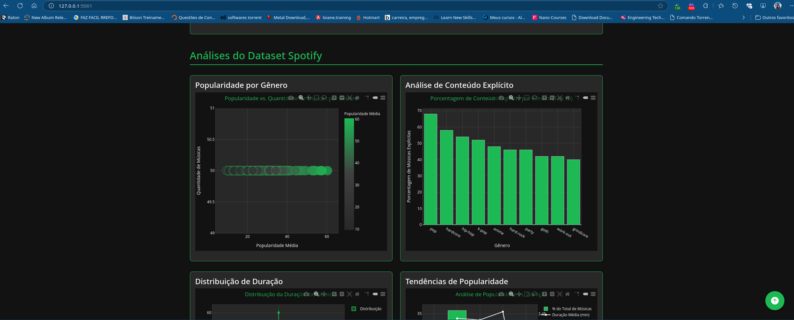

# Dashboard de Análise do Spotify



## Sobre o Projeto

Este projeto consiste em uma análise detalhada dos dados do Spotify, utilizando um dataset rico em informações sobre músicas, popularidade, gêneros e métricas de engajamento. O objetivo é fornecer insights valiosos para otimização de playlists e compreensão das tendências musicais.

## 🎯 Case Study

### Contexto
O mercado musical streaming está em constante evolução, e entender os padrões de consumo e preferências dos usuários é fundamental para o sucesso de qualquer plataforma de música. Este projeto analisa um dataset do Spotify disponível no [Kaggle](https://www.kaggle.com/datasets/ambaliyagati/spotify-dataset-for-playing-around-with-sql) para extrair insights significativos.

### Por que Data Driven?
Em um cenário onde a competição por atenção do usuário é intensa, decisões baseadas em dados são cruciais. Através da análise de dados podemos:
- Otimizar a composição de playlists para maximizar engajamento
- Identificar tendências emergentes em gêneros musicais
- Compreender as preferências do público por diferentes características musicais
- Melhorar a experiência do usuário através de recomendações personalizadas

## 🚀 Funcionalidades

- Análise de popularidade por gênero musical
- Distribuição de duração das músicas
- Análise de conteúdo explícito por gênero
- Matriz de correlação entre variáveis
- Tendências de popularidade
- Insights de negócio
- Recomendações baseadas em dados

## 🛠️ Tecnologias Utilizadas

- Python
- Flask
- Pandas
- Plotly
- HTML/CSS/JavaScript
- Bootstrap

## 📊 Visualizações

O dashboard apresenta diversas visualizações interativas que permitem explorar:
- Distribuição de popularidade por gênero
- Correlações entre diferentes métricas
- Análise temporal de tendências
- Fatores de sucesso para playlists

## 📊 Capturas de Telas

[Gravação de Tela](<captura_telas/Gravação da tela de.2025.02.11.webm>)






## 🎯 Desafios e Soluções

### Desafios Encontrados
1. **Integração de Gráficos Interativos**
   - Problema: Dificuldade na renderização correta dos gráficos Plotly no tema escuro
   - Solução: Implementação de um tema personalizado do Spotify e ajuste dos parâmetros de visualização

2. **Gerenciamento de Arquivos Estáticos**
   - Problema: Imagens e arquivos estáticos não sendo servidos corretamente
   - Solução: Reorganização da estrutura de diretórios e implementação de um sistema robusto de gerenciamento de arquivos estáticos

3. **Responsividade**
   - Problema: Visualizações não se adaptavam bem a diferentes tamanhos de tela
   - Solução: Implementação de um layout responsivo com Bootstrap e ajustes nos parâmetros de redimensionamento dos gráficos

4. **Performance**
   - Problema: Carregamento lento das visualizações
   - Solução: Otimização do processamento de dados e implementação de fallback para imagens estáticas

## 🚀 Como Executar

1. Clone o repositório
```bash
git clone https://github.com/enps2015/spotify-analysis-dashboard.git
```

2. Instale as dependências
```bash
pip install -r requirements.txt
```

3. Execute a aplicação
```bash
python app.py
```

4. Acesse no navegador
```
http://localhost:5001
```

## 📈 Próximos Passos

### Melhorias Planejadas
1. **Análise em Tempo Real**
   - Integração com a API do Spotify para dados em tempo real
   - Atualização automática das visualizações
   - Sistema de cache para otimizar consultas frequentes
   - Monitoramento de métricas em tempo real

2. **Machine Learning**
   - Implementação de modelos preditivos para sucesso de músicas
   - Sistema de recomendação personalizado
   - Análise de sentimento das letras das músicas
   - Clustering de gêneros musicais similares

3. **Interatividade**
   - Filtros mais avançados para exploração dos dados
   - Comparação side-by-side de diferentes períodos
   - Exportação personalizada de relatórios
   - Dashboard customizável pelo usuário

4. **Expansão de Dados**
   - Inclusão de dados de outras plataformas de streaming
   - Análise de tendências regionais
   - Integração com dados de redes sociais
   - Análise de sazonalidade e eventos especiais

### Sugestões para Uso e Aplicações
- **Curadoria de Playlists**
  - Uso dos insights para criar playlists temáticas
  - Otimização baseada em métricas de engajamento
  - Personalização por perfil demográfico

- **Análise de Tendências**
  - Monitoramento de gêneros emergentes
  - Identificação de padrões sazonais
  - Previsão de tendências futuras

- **Estratégia de Lançamentos**
  - Timing ideal baseado em dados históricos
  - Segmentação de público-alvo
  - Otimização de meta-dados

## 📝 Licença

Este projeto está sob a licença MIT. Veja o arquivo [LICENSE](LICENSE) para mais detalhes.

## 👨‍💻 Autor

Desenvolvido por [Eric Pimentel](https://github.com/enps2015)

## 📞 Contato

- LinkedIn: [Eric Pimentel](https://www.linkedin.com/in/eric-np-santos/)
- GitHub: [@enps2015](https://github.com/enps2015)
- Instagram: [@eric.n.pimentel](https://www.instagram.com/eric.n.pimentel/)

---
> "Que a Força dos Dados esteja com você!"
